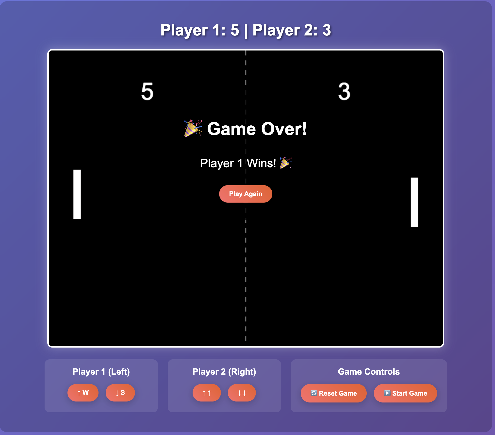

# 🏓 Pong Game - Learn Python with Flask & SQLite

A modern, interactive Pong game built with Python Flask and SQLite database. Perfect for learning Python web development, game programming, and database management!



## 🎮 Features

- **Classic Pong Gameplay**: Two-player paddle game with realistic physics
- **Real-time Multiplayer**: Play against friends with responsive controls
- **Database Integration**: SQLite database for player management and score tracking
- **Leaderboard System**: Track wins and game history
- **Modern Web Interface**: Beautiful, responsive design with smooth animations
- **RESTful API**: Complete Flask API for game control and data management

## 🚀 Quick Start

### Prerequisites
- Python 3.10+
- [uv](https://docs.astral.sh/uv/) package manager

### Installation

1. **Clone the repository**
   ```bash
   git clone <your-repo-url>
   cd example_server
   ```

2. **Install dependencies**
   ```bash
   uv sync
   ```

3. **Run the game server**
   ```bash
   uv run python main.py
   ```

4. **Open your browser**
   Navigate to `http://localhost:5001` and start playing!

## 🎯 How to Play

### Controls
- **Player 1 (Left Paddle)**: 
  - `W` key - Move up
  - `S` key - Move down
- **Player 2 (Right Paddle)**:
  - `↑` Arrow key - Move up  
  - `↓` Arrow key - Move down
- **Spacebar** - Start/Pause game

### Game Rules
- First player to reach **5 points** wins
- Ball bounces off paddles and walls
- Ball speed increases with each hit
- Game automatically saves results to database

## 🏗️ Project Structure

```
example_server/
├── main.py                 # Flask application with game logic
├── templates/
│   └── index.html         # Game frontend (HTML/CSS/JavaScript)
├── pong_game.db           # SQLite database (auto-created)
├── pyproject.toml         # Project dependencies
└── README.md             # This file
```

## 🛠️ Technical Implementation

### Backend (Python/Flask)
- **Game Engine**: Custom PongGame class with physics simulation
- **Database**: SQLite with players and games tables
- **API Endpoints**: RESTful API for game control and data management
- **Real-time Updates**: Game state synchronization

### Frontend (HTML/CSS/JavaScript)
- **Canvas Rendering**: HTML5 Canvas for smooth game graphics
- **Responsive Design**: Modern CSS with gradients and animations
- **Interactive Controls**: Keyboard and button controls
- **Real-time Updates**: AJAX calls for live game state

### Database Schema
```sql
-- Players table
CREATE TABLE players (
    id INTEGER PRIMARY KEY AUTOINCREMENT,
    name TEXT NOT NULL UNIQUE,
    created_at TIMESTAMP DEFAULT CURRENT_TIMESTAMP
);

-- Games table  
CREATE TABLE games (
    id INTEGER PRIMARY KEY AUTOINCREMENT,
    player1_id INTEGER,
    player2_id INTEGER,
    player1_score INTEGER DEFAULT 0,
    player2_score INTEGER DEFAULT 0,
    winner_id INTEGER,
    game_duration INTEGER,
    created_at TIMESTAMP DEFAULT CURRENT_TIMESTAMP,
    FOREIGN KEY (player1_id) REFERENCES players (id),
    FOREIGN KEY (player2_id) REFERENCES players (id),
    FOREIGN KEY (winner_id) REFERENCES players (id)
);
```

## 📡 API Endpoints

| Method | Endpoint | Description |
|--------|----------|-------------|
| `GET` | `/` | Main game page |
| `GET` | `/api/game/state` | Get current game state |
| `POST` | `/api/game/reset` | Reset game to initial state |
| `POST` | `/api/game/update` | Update ball physics |
| `POST` | `/api/game/move` | Move paddle |
| `POST` | `/api/players` | Create new player |
| `GET` | `/api/players` | Get all players |
| `POST` | `/api/games` | Save game result |
| `GET` | `/api/games` | Get game history |
| `GET` | `/api/leaderboard` | Get leaderboard |

## 🎨 Key Learning Concepts

This project demonstrates several important Python and web development concepts:

### Python Concepts
- **Object-Oriented Programming**: PongGame class with methods
- **Database Operations**: SQLite integration with SQL queries
- **Web Framework**: Flask routing and request handling
- **Error Handling**: Try-catch blocks and HTTP status codes
- **Data Structures**: Dictionaries and lists for game state

### Web Development Concepts
- **RESTful API Design**: HTTP methods and status codes
- **Frontend-Backend Communication**: AJAX and JSON
- **Database Relationships**: Foreign keys and JOIN queries
- **Real-time Updates**: Polling and state management
- **User Interface**: HTML5 Canvas and CSS animations

### Game Development Concepts
- **Game Loop**: Continuous update and render cycle
- **Collision Detection**: Ball-paddle and ball-wall interactions
- **Physics Simulation**: Velocity, acceleration, and bouncing
- **State Management**: Game state and player input handling
- **Score Tracking**: Persistent data storage

## 🏆 Features Showcase

### Game Mechanics
- **Realistic Physics**: Ball bounces with spin based on paddle hit position
- **Progressive Difficulty**: Ball speed increases during gameplay
- **Collision Detection**: Precise paddle and wall collision handling
- **Score System**: First to 5 points wins

### Database Features
- **Player Management**: Create and track multiple players
- **Game History**: Complete record of all games played
- **Leaderboard**: Rank players by total wins
- **Data Persistence**: All data saved to SQLite database

### User Interface
- **Responsive Design**: Works on different screen sizes
- **Smooth Animations**: CSS transitions and JavaScript animations
- **Interactive Controls**: Both keyboard and button controls
- **Real-time Updates**: Live score and game state updates

## 🔧 Development Setup

### Running in Development Mode
```bash
# Install dependencies
uv sync

# Run with auto-reload
uv run python main.py
```

### Database Management
The SQLite database (`pong_game.db`) is automatically created on first run. You can inspect it using:
```bash
sqlite3 pong_game.db
.tables
.schema
```

## 🚀 Future Enhancements

- [ ] **AI Opponent**: Computer-controlled paddle for single-player mode
- [ ] **Power-ups**: Special game mechanics and effects
- [ ] **Tournament Mode**: Multi-game tournaments with brackets
- [ ] **Sound Effects**: Audio feedback for game events
- [ ] **Mobile Support**: Touch controls for mobile devices
- [ ] **WebSocket Integration**: Real-time multiplayer over network

## 📚 Learning Resources

This project is perfect for learning:
- **Python Web Development** with Flask
- **Database Design** with SQLite
- **Game Programming** fundamentals
- **Frontend Development** with HTML5 Canvas
- **API Design** and RESTful services
- **Real-time Applications** and state management

## 🤝 Contributing

Feel free to fork this project and add your own features! Some ideas:
- Add sound effects and music
- Implement different game modes
- Create a mobile-responsive version
- Add tournament brackets
- Implement chat functionality

## 📄 License

This project is open source and available under the MIT License.

---

**Happy Coding! 🐍🎮**

*Built with ❤️ using Python, Flask, SQLite, and modern web technologies*
